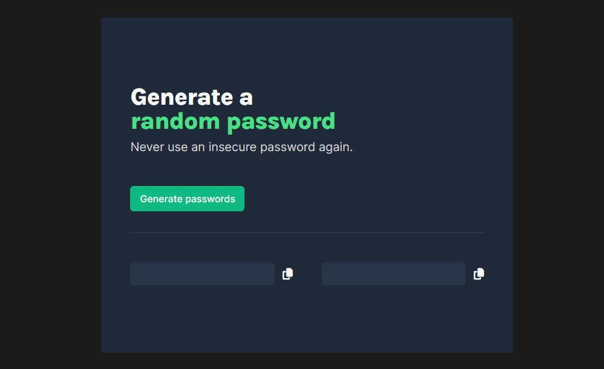

# Password-Generator

## Table of Contents

- [Password-Generator](#password-generator)
  - [Table of Contents](#table-of-contents)
  - [Project Overview](#project-overview)
  - [Demo](#demo)
  - [Key Features](#key-features)
  - [How to Use](#how-to-use)
  - [License](#license)

## Project Overview

This is a solo project completed as part of the Scrimba Front-End Path. It consists of a A Random Password Generator with Copy-to-Clipboard Feature app.



## Demo

- Live demo: [Password Generator](https://dz-password-generator.netlify.app/)

## Key Features

1. **Random Password Generation**: Clicking the "Generate Passwords" button generates two 15-character random passwords using a variety of characters, including uppercase letters, lowercase letters, numbers, and special symbols.

2. **Copy-to-Clipboard**: Users can copy a generated password to their clipboard by clicking on it. A tooltip briefly confirms the successful copy operation.

## How to Use

1. **Clone the repository**:

First, you'll need to clone this repository to your local machine. Open your terminal and run the following command:

```git
git clone https://github.com/hichamweblog/Password-Generator.git
```

2. **Navigate to the Project Folder**:

Change your working directory to the newly cloned project folder:

```git
 cd Password-Generator
```

3. **Install Dependencies**:

Install the required packages by running:

```git
npm install
```

4. **Run the project**:

```git
npm run dev
```

This command will launch a development server, and you'll be able to view the website locally in your web browser.

## License

This project is licensed under the [MIT License](./LICENSE).
